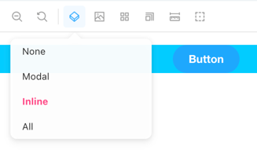

<!-- README START -->

# Storybook Addon: Story Container Switcher

Allows you to define containers that will be wrapped around your stories.
It offers a UI to switch between the containers, and also supports displaying your stories in all containers at once.

Below is an example on how to define containers for a story.


```js
Primary.parameters = {
  storyContainers: [
    {
      id: "modal",
      label: "Modal",
      container: YourFancyModalComponent,
    },
    {
      id: "inline",
      label: "Inline",
      container: ({ children }) => (
        <div
          style={{
            width: "100%",
            height: "100%",
            backgroundColor: "#0cf",
            display: "flex",
            justifyContent: "center",
            alignItems: "center",
          }}
        >
          {children}
        </div>
      ),
    },
  ],
};
```

See the file [button.stories.js](stories/button.stories.js) for a full example.
You can also define the containers globally, see [preview.js](.storybook/preview.js).

## Development scripts

- `yarn start` runs babel in watch mode and starts Storybook
- `yarn build` build and package your addon code
